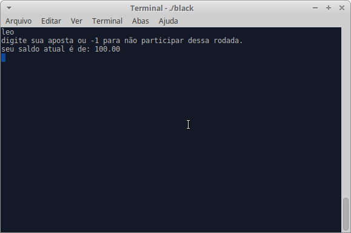

# Blackjack

Projeto implementado na disciplina de Fundamentos de Programação da Universidade Federal do Ceará campus Quixadá.



## Criar Executável

**Executar no terminal:** 

```terminal
gcc main.c -o black
```

## Iniciar Jogo 

**Executar no terminal:** 

```terminal
./black
```